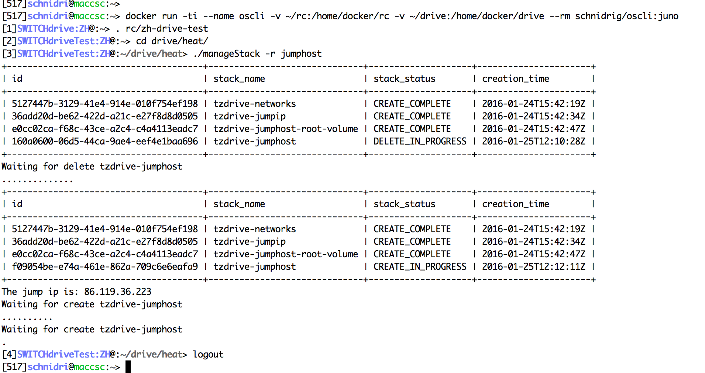

# Openstack CLI

CLI commands for openstack.

# Prepare Authentication

Openstack CLI requires you to set a few environment variables with the authentication info. 
You should create a file for each account/tenant/region you have access to and then put them all in one directory. 
Let's assume that dir is `~/rc`.

Example `~/rc/default-openrc.sh` file:

	export OS_AUTH_URL=https://keystone.cloud.switch.ch:5000/v2.0
	export OS_TENANT_NAME="SWITCH"
	export OS_USERNAME="christian.schnidrig@switch.ch"
	export OS_REGION_NAME="ZH"

	echo "Please enter your OpenStack Password: "
	read -sr OS_PASSWORD_INPUT
	export OS_PASSWORD=$OS_PASSWORD_INPUT

If you have a file named 'default-openrc.sh', it'll be loaded automatically on container initialization.

# Run Container:

	docker run -ti --name oscli -v ~/rc:/home/docker/rc schnidrig/oscli:juno

If you want, you may add in some scripts of yours. E.g.

	docker run -ti --name oscli -v ~/rc:/home/docker/rc -v ~/myScripts:/home/docker/myScripts schnidrig/oscli:juno

If you need a second shell:

	docker exec -ti oscli bash
	
# Available Tags:

The following tags are available:

- juno: ubuntu 14.04 with "cloud-archive:juno" 
- kilo: ubuntu 14.04 with "cloud-archive:kilo" 

# Build Image

This is not needed unless you wish to change the image. 

    cd build
    docker build -f Dockerfile.juno -t oscli:juno .

now you can use the image. 

If you have a dockerhub account you can push it with: (e.g. to account "schnidrig")
    
    docker tag -f oscli:juno schnidrig/oscli:juno .
    docker push schnidrig/oscli:juno
    
# Usage example

